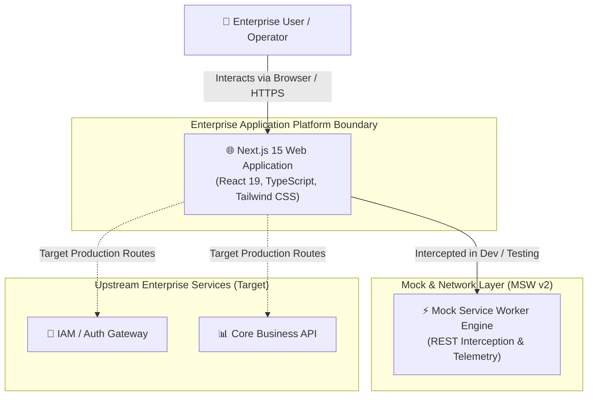
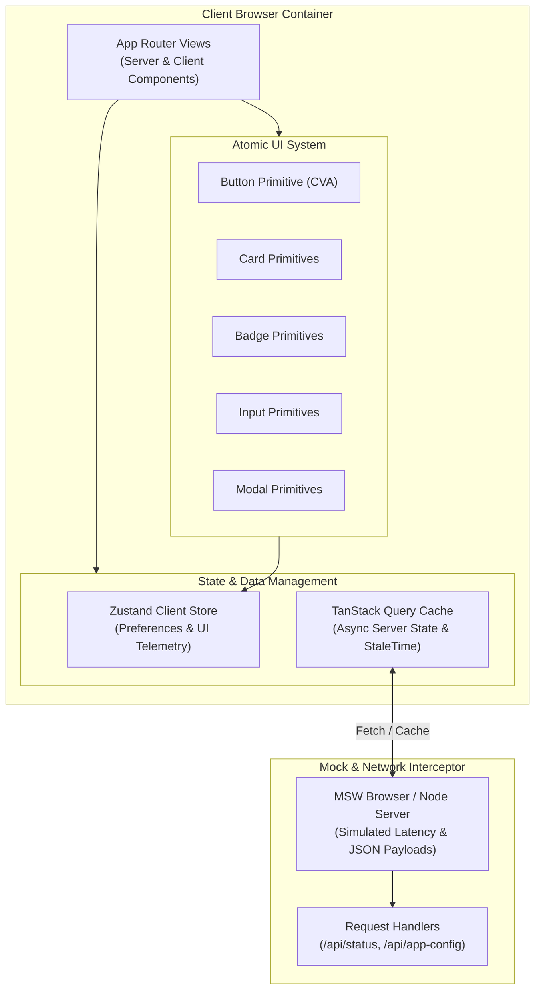
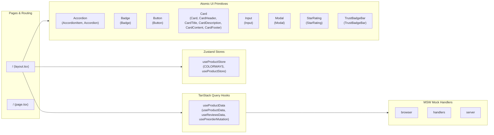

# Enterprise System Architecture & Living Interaction Matrix

> [!NOTE]
> This document is **100% auto-generated** via AST code introspection (`scripts/generate-architecture-matrix.js`). Any manual edits will be overwritten during verification (`npm run verify`) or synchronization (`npm run docs:sync`).
> **Last Synchronized:** `2026-08-17T08:19:52.814Z`

---

## 1. C4 Architecture Level 1: System Context Diagram

The System Context diagram illustrates the high-level boundary of the Enterprise Application Foundation and external system actors.

---

## 2. C4 Architecture Level 2: Container Diagram

The Container diagram illustrates the runtime execution boundaries within the client and mock infrastructure.

---

## 3. C4 Architecture Level 3: Component Interaction Matrix

The Component diagram maps the discovered AST dependencies between UI components, state stores, and query hooks.

---

## 4. AST-Extracted Component & Module Inventory

Summary of auto-discovered source modules:
- **Total Source Files Analyzed:** `95`
- **Application Routes:** `2`
- **State Stores:** `1`
- **Query Hooks:** `1`
- **Atomic UI Primitives:** `8`

### Module Breakdown Table

| Category | File Path | Exported Symbols | Key Dependencies |
| :--- | :--- | :--- | :--- |
| **Route** | `src/app/layout.tsx` | `metadata, RootLayout` | `none` |
| **Route** | `src/app/page.tsx` | `HomePage` | `@/components/presentation/Navbar, @/components/presentation/HeroSection, @/components/presentation/SoundExperience, @/components/presentation/AcousticBento, @/components/presentation/ColorStudio, @/components/presentation/TechnicalSpecs, @/components/presentation/ReviewsSection, @/components/presentation/FAQSection, @/components/presentation/Footer, @/components/presentation/CheckoutDrawer` |
| **Store** | `src/stores/useProductStore.ts` | `COLORWAYS, useProductStore` | `zustand` |
| **Query** | `src/hooks/queries/useProductData.ts` | `useProductData, useReviewsData, usePreorderMutation` | `@tanstack/react-query, @/mocks/handlers` |
| **UI Primitive** | `src/components/ui/Accordion.tsx` | `AccordionItem, Accordion` | `react, lucide-react` |
| **UI Primitive** | `src/components/ui/Badge.tsx` | `badgeVariants, Badge` | `react, class-variance-authority, @/lib/utils` |
| **UI Primitive** | `src/components/ui/Button.tsx` | `buttonVariants, Button` | `react, class-variance-authority, @/lib/utils` |
| **UI Primitive** | `src/components/ui/Card.tsx` | `Card, CardHeader, CardTitle, CardDescription, CardContent, CardFooter` | `react, @/lib/utils` |
| **UI Primitive** | `src/components/ui/Input.tsx` | `Input` | `react, @/lib/utils` |
| **UI Primitive** | `src/components/ui/Modal.tsx` | `Modal` | `react, lucide-react, @/lib/utils, ./Button` |
| **UI Primitive** | `src/components/ui/StarRating.tsx` | `StarRating` | `react, lucide-react` |
| **UI Primitive** | `src/components/ui/TrustBadgeBar.tsx` | `TrustBadgeBar` | `react, lucide-react` |
| **Mock / Network** | `src/mocks/browser.ts` | `worker` | `msw` |
| **Mock / Network** | `src/mocks/handlers.ts` | `mockProductData, mockReviewsData, handlers` | `msw` |
| **Mock / Network** | `src/mocks/server.ts` | `server` | `msw` |

---

## 5. Architectural Quality Attributes

1. **Deterministic Test Isolation:** Tests execute with MSW intercepting all network activity, eliminating flaky external dependencies.
2. **Predictable State Mutations:** All client UI preferences and state transitions are centralized in Zustand with full test reset capability.
3. **Atomic Component Encapsulation:** All UI elements are built with `class-variance-authority` and strict ARIA accessibility standards.
4. **Living Documentation Enforcement:** The 7-Gateway Quality Engine verifies that this document reflects current codebase reality on every commit.
