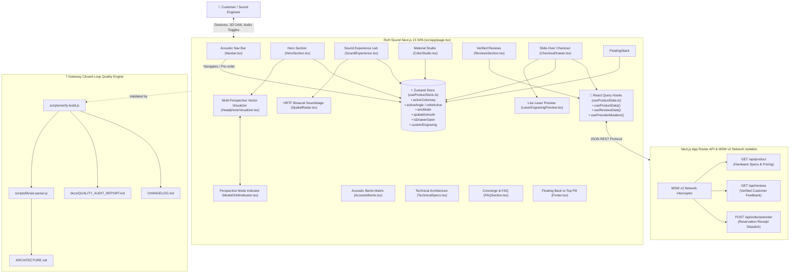
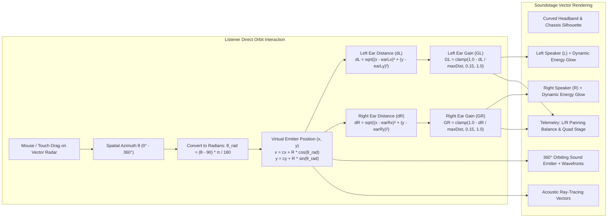
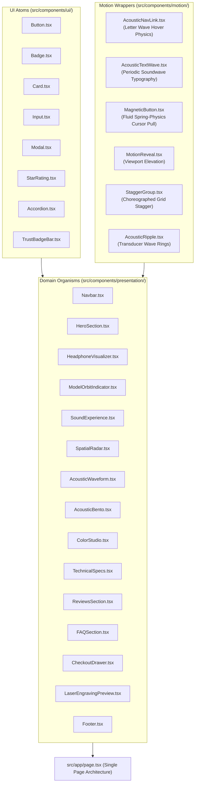

# RoH Sound — Flagship Product Presentation SPA

[](./LICENSE)
[](https://github.com/calin-m/RoH-Sound/actions)
[](https://roh-sound.vercel.app/)
[](https://github.com/calin-m/RoH-Sound)
[](https://nextjs.org/)
[](https://react.dev/)
[](https://www.typescriptlang.org/)
[](https://www.w3.org/Graphics/SVG/)
[](https://tailwindcss.com/)
[-green?style=for-the-badge&logo=vitest)](https://vitest.dev/)
[](https://mswjs.io/)
[](./DEVELOPMENT.md)

An ultra-refined, high-performance **Product Presentation Single Page Application** for **RoH Sound** (*"Pure Acoustic Architecture. Zero Distortion."*). Engineered with a **Light Modern Minimalistic Sleek Atelier** design aesthetic, Next.js 15 App Router, High-Precision Multi-Perspective Vector SVG Showcase, precision HRTF vector spatial audio ray-tracing, lightweight Zustand reactive state, and the deterministic 7-Gateway Quality Engine.

> 🌐 **Live Demo:** [https://roh-sound.vercel.app/](https://roh-sound.vercel.app/)  
> 📦 **GitHub Repository:** [https://github.com/calin-m/RoH-Sound](https://github.com/calin-m/RoH-Sound)

---

## 🎯 Project Scope & Demonstration Intent

This project is a **high-end front-end product presentation, marketing showcase, and interactive modern minimalistic demo** engineered to demonstrate modern, production-grade web architecture, creative procedural animations, and seamless responsive design:

- **Interactive Atelier Showcase:** Features a High-Precision Multi-Perspective Vector SVG visualizer (Front 0°, Controls & Ports, 90° Profile View, and Exploded Transducer Anatomy) with smooth perspective switching, dynamic finish colorways with specular metallic sweeps, touch swipe navigation, calm 3-second ambient breathing animations, and interactive benchmark matrices.
- **Acoustic Visual Simulations:** Showcases real-time visual and mathematical models of acoustic principles, including autonomous 60fps traveling sinusoidal waves for Active Noise Cancellation and an interactive 360° HRTF Binaural Soundstage with vector ray-tracing and Interaural Level Difference (ILD) ear gain calculations.
- **Simulated Reservation Flow:** Includes a slide-over pre-order reservation drawer with live CNC laser engraving preview, dynamic warranty recalculation, and simulated order dispatch codes powered by Mock Service Worker (MSW v2) and Next.js App Router API handlers.
- **Scope Boundary:** This codebase is intentionally designed as a **presentation and portfolio demonstration web application**. It is not a hardware companion utility (e.g. firmware or physical Bluetooth headphone control) or a live payment-processing e-commerce backend.

---

## 📑 Table of Contents
- [🎯 Project Scope & Demonstration Intent](#-project-scope--demonstration-intent)
- [🏛️ System Architecture Diagrams](#-system-architecture-diagrams)
  - [1. End-to-End System Context & Data Flow](#1-end-to-end-system-context--data-flow)
  - [2. Precision HRTF Binaural Soundstage Engine](#2-precision-hrtf-binaural-soundstage-engine)
  - [3. Atomic Component & Design System Tree](#3-atomic-component--design-system-tree)
- [✨ Core Presentation Experience](#-core-presentation-experience)
- [⚡ Quick Start](#-quick-start)
- [🛠️ CLI Command Matrix](#️-cli-command-matrix)
- [🛡️ The 7-Gateway Quality Engine](#️-the-7-gateway-quality-engine)
- [📚 Living Documentation Registry](#-living-documentation-registry)

---

## 🏛️ System Architecture Diagrams

### 1. End-to-End System Context & Data Flow



---

### 2. Precision HRTF Binaural Soundstage Engine



---

### 3. Atomic Component & Design System Tree



---

## ✨ Core Presentation Experience

| # | Section | Key Features & Engineering Highlights |
| :-: | :--- | :--- |
| **01** | **Atelier Capsule Navbar** | Brand monogram `[R]` with animated speaker transducer cone excursion and hover volume dampening, split-letter wave elevation (`translateY(-3.5px)`) staggered by $24\text{ms}$ with spring physics, responsive `lg` breakpoint (1024px), adaptive Pre-Order pill (`Pre-Order` on mobile $\rightarrow$ `Pre-Order • $399` on desktop), animated mobile drawer with tap-outside backdrop, `Escape` key dismissal, and `Close [ESC] [X]` header bar. |
| **02** | **Acoustic Hero & Studio Showcase** | High-Precision Multi-Perspective Vector SVG visualizer with 4 architectural viewpoints (**Front 0°**, **Controls with Tangent-Docked Buttons & Ports**, **Profile 90° View**, and **Anatomy Exploded Transducer Assembly**), responsive 4-column perspective grid switcher, mobile touch swipe gesture support, automated tour mode, calm 3-second ambient breathing glow, and Grounded Pre-Order CTA with interactive magnetic cursor tracking and soundwave typography. |
| **03** | **Interactive Sound Lab** | Triple-mode Active Noise Cancellation simulator (Transparency, Balanced, Ultra 48dB) with **autonomous 60fps pure traveling sinusoidal waves** (solid obsidian acoustic signal + synchronized 180° gold dashed anti-phase cancellation wave) and decibel attenuation ripples, plus a 360° HRTF Binaural Soundstage with **direct-drag pointer capture orbit**, listener anatomy, left/right driver energy glow, and real-time acoustic vector ray-tracing. |
| **04** | **Acoustic Bento Matrix** | Asymmetric bento grid with corner light refraction sweeps and acoustic transducer diaphragm hover auras, showcasing the 45mm Custom Graphene Driver, Aerospace Titanium chassis, 65-Hour Extended Battery, and Lossless 24-bit/192kHz LDAC Bluetooth 5.4. |
| **05** | **Color Studio** | Interactive finish atelier featuring Midnight Obsidian, Champagne Platinum, Raw Titanium, and Forest Emerald with live metallurgical shader sync and **specular metallic sheen light sweeps** on selection. |
| **06** | **Technical Architecture** | Complete laboratory metrics with animated category tabs and spec row hover illumination, frequency response curves ($4\text{Hz} - 48\text{kHz}$), desktop 4-column side-by-side benchmark table, and mobile-native **Interactive Versus Switcher** (`[ vs Brand S ]` | `[ vs Brand B ]`) with stacked advantage cards. |
| **07** | **Customer Reviews** | Acclaimed customer feedback from verified sound engineers and mastering specialists with star ratings and verified buyer credentials. |
| **08** | **Inquiries & FAQ** | Accordion-based inquiry hub with smooth height expansion, top-anchored rotating chevrons, and illuminated champagne gold margin draws. |
| **09** | **Slide-Over Checkout Drawer** | Hardware-accelerated 400ms slide-in/out cubic-bezier drawer with backdrop tap/click outside dismissal, Escape key handling, live personalized laser engraving with **animated CNC laser spark focal indicator**, warranty selection, and instant reservation code dispatch. |
| **10** | **Atelier Footer & Floating Back to Top** | Direct hyperlink for Calin M to the GitHub profile, alongside a Documentation directory and a glassmorphic floating **Back to Top** pill with smooth scroll physics. |

---

## ⚡ Quick Start

### Prerequisites
- **Node.js**: `>= 20.0.0` (Node 22 LTS recommended)
- **npm**: `>= 10.0.0`

### Installation & Local Development
```bash
# 1. Clone repository and install dependencies
npm install

# 2. Start local development server (automatically opens http://localhost:3000)
npm run dev:open

# 3. Or launch full development environment with background test watcher
npm run dev:all
```

---

## 🛠️ CLI Command Matrix

| Command | Purpose | Verification Scope |
| :--- | :--- | :--- |
| `npm run dev` | **Next.js Dev Server** | Launches App Router dev server on `http://localhost:3000` |
| `npm run dev:open` | **Dev Server + Browser** | Launches dev server and auto-opens browser |
| `npm run dev:all` | **Full Dev Environment** | Runs Next.js dev server alongside CLI terminal test watcher |
| `npm run verify` | **Master 7-Gateway Gatekeeper** | Runs full closed-loop audit: Secrets, Types, Tests, Living Docs, ADRs, Lint, Knip, Build |
| `npm test` | **Vitest Test Suite** | Runs all 86 test suites (110 tests) with v8 code coverage reporting |
| `npm run test:ui` | **Vitest Graphical UI** | Interactive browser-based test suite visualizer & debugger |
| `npm run test:watch` | **Test Watcher** | Fast continuous test execution during active coding |
| `npm run typecheck` | **TypeScript Typecheck** | Strict typecheck across all `.ts` and `.tsx` source files (`0 compile errors`) |
| `npm run lint` | **ESLint Linter** | Strict Next.js and React Core Web Vitals lint inspection |
| `npm run knip` | **Dead-Code Auditor** | AST analysis ensuring zero unused files, exports, or dependencies |
| `npm run docs:sync` | **Living Documentation Sync** | AST introspection generating `ARCHITECTURE.md`, `docs/QUALITY_AUDIT_REPORT.md`, and `CHANGELOG.md` |
| `npm run report` | **Quality Report Generator** | Generates Markdown & JSON quality telemetry |
| `npm run adr:new -- "Title"` | **New Architecture Decision** | Creates sequentially numbered ADR in `docs/DECISIONS.md` |
| `npm run build` | **Production Next.js Build** | Compiles optimized Next.js 15 production bundle |

---

## 🛡️ The 7-Gateway Quality Engine

Every contribution is validated through 7 deterministic quality gateways, executed automatically via **Git Pre-Commit Hook (`.husky/pre-commit`)** and on every push via **GitHub Actions CI (`.github/workflows/ci.yml`)**:

```
+-----------------------------------------------------------------------------+
|                      7-GATEWAY CLOSED-LOOP VERIFICATION                     |
+-----------------------------------------------------------------------------+
| Pass 0.5 | Secret Scanner      | Checks repository files for exposed keys   |
| Pass 1   | TypeScript Engine   | Strict typecheck with 0 compile errors     |
| Pass 2   | Vitest Server Mocks | Validates MSW v2 handlers and query hooks  |
| Pass 3   | Vitest Client UI    | Unit & integration tests (>= 85% coverage) |
| Pass 4   | Living Docs Sync    | Auto-updates ARCHITECTURE, AUDIT, & CHANGE |
| Pass 5   | ADR Validation      | Validates DECISIONS.md sequential schema   |
| Pass 6   | Quality & Dead Code | ESLint check and Knip unused code audit    |
| Pass 7   | Production Build    | Compiles Next.js 15 production bundle      |
+-----------------------------------------------------------------------------+
```

1. **Pass 0.5 (Secret Scanner):** Scans all codebase files for private keys, AWS/GCP tokens, or exposed API credentials.
2. **Pass 1 (TypeScript Strict Typecheck):** Verifies 0 compile errors via `tsc --noEmit`.
3. **Pass 2 (Vitest MSW Server & Queries):** Validates network mocking and query hook state transitions.
4. **Pass 3 (Vitest Client UI & Primitives):** Executes all test suites and asserts **≥ 85% code coverage** (*current: 95.37%*).
5. **Pass 4 (Living Architecture & Quality Sync):** Auto-generates C4 matrices in `ARCHITECTURE.md`, compiles `docs/QUALITY_AUDIT_REPORT.md`, and syncs `CHANGELOG.md`.
6. **Pass 5 (ADR Decision Ledger Validation):** Verifies sequential numbering and schema conformance in `docs/DECISIONS.md`.
7. **Pass 6 (ESLint & Knip Audit):** Validates 0 lint errors and 0 dead code/unused exports.
8. **Pass 7 (Production Build Compilation):** Validates compilation of the production Next.js 15 bundle.

> 🔒 **Pre-Commit Enforcement:** Any failure in Passes 0.5 through 7 immediately halts execution, outputs exact error telemetry to the terminal, and automatically blocks the commit from being created.

---

## 📚 Living Documentation Registry

- **Living System Architecture (C4 Level 1-3):** [`ARCHITECTURE.md`](./ARCHITECTURE.md)
- **Quality & Coverage Audit Report:** [`docs/QUALITY_AUDIT_REPORT.md`](./docs/QUALITY_AUDIT_REPORT.md)
- **Machine-Readable Audit Telemetry:** [`docs/quality-audit-results.json`](./docs/quality-audit-results.json)
- **Architecture Decision Records (ADRs):** [`docs/DECISIONS.md`](./docs/DECISIONS.md)
- **Master Governance & Operations Protocol:** [`.agents/AGENTS.md`](./.agents/AGENTS.md)
- **CI/CD Pipeline Guide:** [`docs/PIPELINE_GUIDE.md`](./docs/PIPELINE_GUIDE.md)
- **Developer Maintenance Hub:** [`DEVELOPMENT.md`](./DEVELOPMENT.md)
- **Semantic Release Changelog:** [`CHANGELOG.md`](./CHANGELOG.md)

---

## 📄 License

This project is licensed under the [MIT License](./LICENSE) — Copyright © 2026 [calin-m](https://github.com/calin-m).

