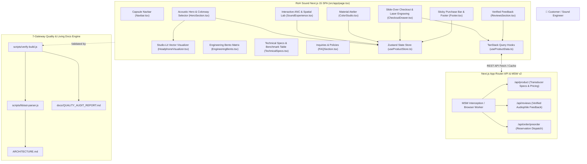

# RoH Sound — Product Presentation Single Page Application

[](https://nextjs.org/)
[](https://react.dev/)
[](https://www.typescriptlang.org/)
[](https://tailwindcss.com/)
[](https://vitest.dev/)
[](https://mswjs.io/)
[](./DEVELOPMENT.md)

An ultra-refined, high-performance **Product Presentation Single Page Application** for **RoH Sound** (*"Pure Acoustic Architecture. Zero Distortion."*) built with a Light Minimalistic Sleek luxury design language, Next.js 15 App Router, Zustand state management, TanStack React Query, MSW v2 network isolation, and a Closed-Loop 7-Gateway Quality Engine.

---

## 🏛️ System Architecture



---

## ⚡ Quick Start

### Prerequisites
- **Node.js**: `>= 20.0.0`
- **npm**: `>= 10.0.0`

### Installation & Local Development
```bash
# 1. Install all dependencies
npm install

# 2. Run local development server (auto-opens browser)
npm run dev:open

# 3. Access presentation at http://localhost:3000
```

---

## 🛠️ CLI Command Matrix

| Command | Purpose | Verification Scope |
| :--- | :--- | :--- |
| `npm run dev` | **Next.js Dev Server** | Launches App Router dev server on http://localhost:3000 |
| `npm run dev:open` | **Dev Server + Browser** | Launches dev server and automatically opens http://localhost:3000 in browser |
| `npm run dev:all` | **Full Dev Environment** | Launches Next.js dev server & CLI terminal test watcher, auto-opening http://localhost:3000 |
| `npm run verify` | **Master 7-Gateway Gatekeeper** | Secrets, Types, Tests (≥ 85% cov), Living Docs, ADRs, Lint, Knip, Build |
| `npm test` | **Vitest Test Suite** | Runs all 20 test suites with v8 code coverage reporting |
| `npm run test:ui` | **Vitest Graphical UI** | Interactive test explorer & execution visualizer |
| `npm run test:watch` | **Test Watcher** | Continuous test runner for active feature development |
| `npm run typecheck` | **TypeScript Typecheck** | Strict typecheck across all `.ts` and `.tsx` source files |
| `npm run lint` | **ESLint Linter** | Next.js and React Core Web Vitals lint inspection |
| `npm run knip` | **Dead-Code Auditor** | Unused file, export, and dependency identification |
| `npm run docs:sync` | **Living Documentation Sync** | AST introspection generating `ARCHITECTURE.md` and `docs/QUALITY_AUDIT_REPORT.md` |
| `npm run report` | **Quality Report Generator** | Generates Markdown & JSON quality metrics from test results |
| `npm run adr:new -- "Title"` | **New Architecture Decision** | Appends numbered ADR entry to `docs/DECISIONS.md` |
| `npm run build` | **Production Next.js Build** | Compiles production-ready bundle |

---

## 🛡️ The 7-Gateway Quality Engine

Every contribution is validated through 7 deterministic quality gateways:
1. **Pass 0.5 (Secret Scanner):** Scans codebase for private keys, AWS/GCP tokens, or exposed credentials.
2. **Pass 1 (TypeScript Strict Typecheck):** Verifies zero type errors via `tsc --noEmit`.
3. **Pass 2 (Vitest MSW Server & Queries):** Validates network mocking and query hook state transitions.
4. **Pass 3 (Vitest Client UI & Primitives):** Executes unit/integration test suites and asserts **≥ 85% code coverage**.
5. **Pass 4 (Living Architecture & Quality Sync):** Auto-generates C4 diagrams in `ARCHITECTURE.md`, compiles `docs/QUALITY_AUDIT_REPORT.md`, and updates `CHANGELOG.md`.
6. **Pass 5 (ADR Decision Ledger Validation):** Verifies sequential numbering and schema conformance in `docs/DECISIONS.md`.
7. **Pass 6 (ESLint & Knip Audit):** Zero lint warnings and zero dead code.
8. **Pass 7 (Production Build Compilation):** Validates compilation with `next build`.

---

## 📚 Living Documentation Links

- **Living Architecture Matrix (C4 Level 1-3):** [`ARCHITECTURE.md`](./ARCHITECTURE.md)
- **Quality & Coverage Audit Report:** [`docs/QUALITY_AUDIT_REPORT.md`](./docs/QUALITY_AUDIT_REPORT.md)
- **Architecture Decision Records (ADRs):** [`docs/DECISIONS.md`](./docs/DECISIONS.md)
- **Master Governance Protocol:** [`.agents/AGENTS.md`](./.agents/AGENTS.md)
- **CI/CD Pipeline Guide:** [`docs/PIPELINE_GUIDE.md`](./docs/PIPELINE_GUIDE.md)
- **Developer Guide:** [`DEVELOPMENT.md`](./DEVELOPMENT.md)
- **Project Changelog:** [`CHANGELOG.md`](./CHANGELOG.md)
