# Enterprise CI/CD Pipeline & Quality Gate Guide

This document defines the continuous integration and deployment (CI/CD) automation standards, gate thresholds, and artifact promotion policies.

---

## 1. Pipeline Architecture Overview

```mermaid
flowchart LR
    Commit["Git Commit / PR"] --> Gate0["Pass 0.5: Secret Scan"]
    Gate0 --> Gate1["Pass 1: TypeScript"]
    Gate1 --> Gate2["Pass 2 & 3: Vitest (>=85% Cov)"]
    Gate2 --> Gate4["Pass 4: Living Docs Sync"]
    Gate4 --> Gate5["Pass 5: ADR Validation"]
    Gate5 --> Gate6["Pass 6: Lint & Knip"]
    Gate6 --> Gate7["Pass 7: Next.js Build"]
    Gate7 --> Deploy["Production Deployment"]
```



---

## 2. GitHub Actions Reference Workflow

The CI/CD pipeline runs on every Pull Request and merge to `main`:

```yaml
name: Enterprise Quality Gate & Continuous Delivery

on:
  push:
    branches: [main, develop]
  pull_request:
    branches: [main, develop]

jobs:
  quality-gate:
    name: 7-Gateway Quality Engine
    runs-on: ubuntu-latest

    steps:
      - name: Checkout Repository
        uses: actions/checkout@v4
        with:
          fetch-depth: 0

      - name: Setup Node.js 20
        uses: actions/setup-node@v4
        with:
          node-version: 20
          cache: 'npm'

      - name: Install Dependencies
        run: npm ci

      - name: Execute 7-Gateway Verification
        run: npm run verify

      - name: Upload Test & Coverage Artifacts
        uses: actions/upload-artifact@v4
        if: always()
        with:
          name: quality-reports
          path: |
            docs/QUALITY_AUDIT_REPORT.md
            docs/quality-audit-results.json
            coverage/
```

---

## 3. Quality Gate Thresholds & SLA Table

| Gate Stage | Pass Criteria | Action on Failure |
| :--- | :--- | :--- |
| **Pass 0.5 (Secrets)** | 0 detected secret patterns or tokens | Pipeline terminated immediately; alert triggered |
| **Pass 1 (Typecheck)** | 0 TypeScript compiler errors | Pipeline blocked |
| **Pass 2 & 3 (Testing & Coverage)** | 100% test pass rate + **≥ 85% code coverage** | Pipeline blocked; PR merge prohibited |
| **Pass 4 (Docs Sync)** | Clean AST compilation of living docs | Auto-commits or asserts zero diff |
| **Pass 5 (ADR Ledger)** | Sequential ADR-00X numbering and required fields | PR blocked until ADR schema is fixed |
| **Pass 6 (Lint & Dead Code)** | 0 ESLint errors + 0 unused exports (Knip) | PR blocked |
| **Pass 7 (Production Build)** | `next build` exits with code 0 | Deployment aborted |
